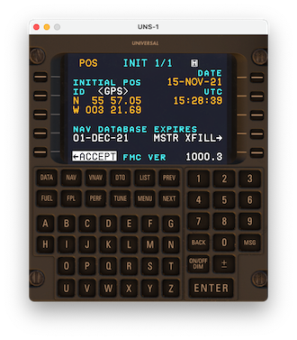

# X-UNS Bug Tracker

  

This is the bug tracker for x-uns (UNS-1 FMS simulation for X-Plane 11). If you have encountered
a bug, crash or oddity using the FMS, please report it here by clicking on [issues](issues), and
creating a new report.

**Please make sure to include a log with any report (preferably, the `uns1_log.txt` file present
in your main X-Plane folder), as well as a detailed description of what happened and what went
wrong. Any additional info is helpful (screenshots, etc).**

## Code of Conduct

When interacting with users on this platform, you are expected to be respectful and welcoming
of all users and not harass anyone, regardless of age, body size, visible or
invisible disability, ethnicity, sex characteristics, gender identity and expression,
level of experience, education, socio-economic status, nationality, personal appearance,
race, caste, color, religion, or sexual identity and orientation.

Examples of unacceptable behavior include:

* The use of sexualized language or imagery, and sexual attention or advances of
  any kind
* Trolling, insulting or derogatory comments, and personal or political attacks
* Public or private harassment
* Publishing others' private information, such as a physical or email address,
  without their explicit permission
* Other conduct which could reasonably be considered inappropriate in a
  professional setting
  
Any breach of those rules will lead to your account being banned from this repository.
